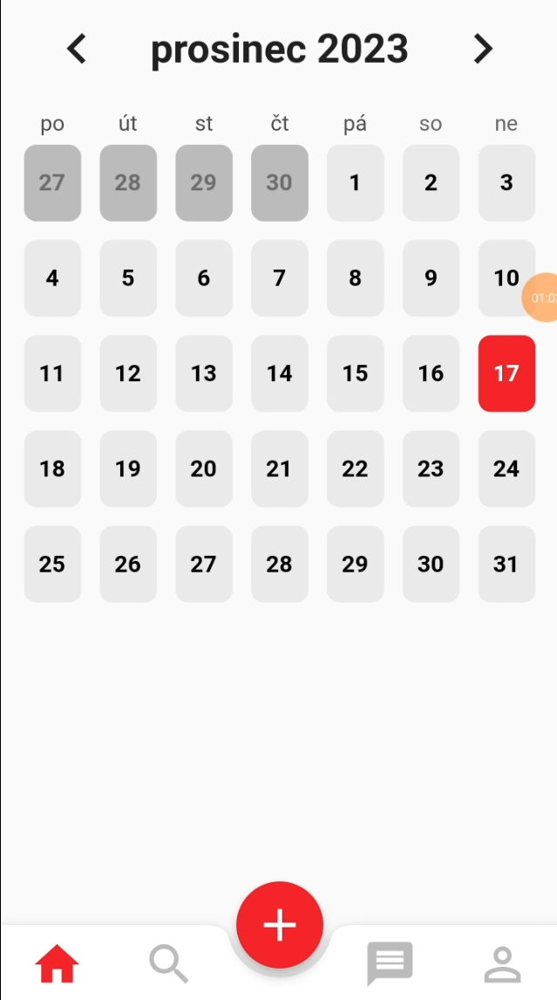
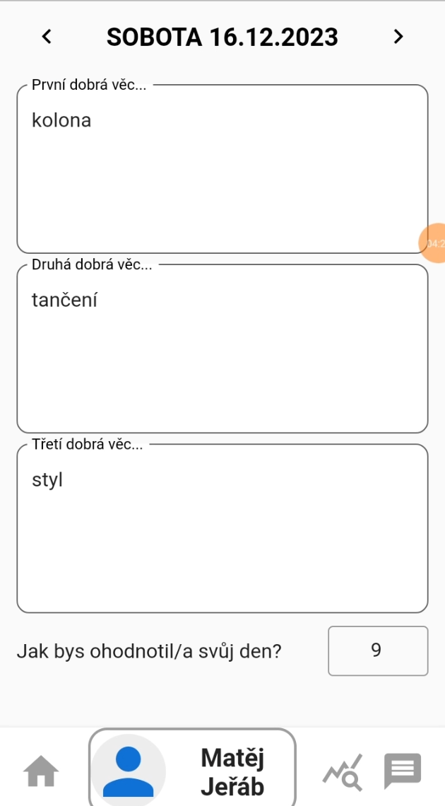

# Aplikace Flow-List
## Pro FIT VUT, předmět ITU - Návrh uživatelských prostředí
Autoři:
Jakub Jeřábek (xjerab28),
Vojtěch Teichmann (xteich02),
Doubravka Šimůnková (xsimun05)

# Jak spustit vývojové prostředí?
1. Nainstalujte Flutter a Android Studio
2. V Android Studiu vytvořte emulované zařízení
3. V složce s projektem napište *flutter pub get*, což stáhne potřebné závislosti
4. Následně pomocí vestavěného debug módu můžete aplikaci spustit, 
nebo vytvořit instalační apk skrze příkaz *flutter build apk*

## Screenshots

Obrázek 1: Úvodní informace o aplikaci a o tom, jak funguje

Obrázek 2: Pohled na kalendář a menu

Obrázek 3: Vyplňování záznamu pro jednotlivý den